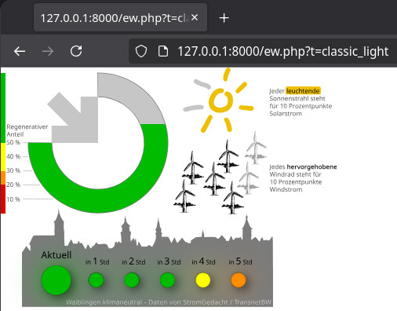

# Waiblinger Energiewendeuhr

Ein Rewrite der Energiewendeuhr. Zu finden unter https://energiewendeuhr.de/

Ziel:
 - Verschiedene Grafiken und Rohdaten-Formate durch Templates: Sei es ein SVG-Bild oder nur rohe Messwerte
 - Ordentliches Reagieren auf fehlende Daten (TODO)
 - weg vom begrenzten Nur-Filehost wieland.srvx.de/energiewende

Datenfluss:
 - Eine InfluxDB v2 Datenbank zum Speichern der Werte
 - Ein Python-Skript liest jeden Abend per Cronjob die Vorhersagen für den kommenden Tag und schreibt sie in die Datenbank
 - Beim Webseitenaufruf liest ew.php die Werte aus der Datenbank und übergibt sie dem gewünschten Template.

 - Nginx+PHP, InfluxDB und dieser Python-Cronjob sind alle direkt auf einem Debian VPS (wer braucht schon Container!?)

SMARD-Daten zu Sonne und Wind fehlen noch völlig



---

Installationsnotizen: (Könnte man das schöner machen? Reproduzierbarer!? Mit Containern!?? Ja!)

```bash
# InfluxDB

sudo apt install gpg curl git python-is-python3 python3-pip python3-dotenv
curl https://repos.influxdata.com/influxdata-archive.key | gpg --dearmor | sudo tee /usr/share/keyrings/influxdb-archive-keyring.gpg >/dev/null
echo "deb [signed-by=/usr/share/keyrings/influxdb-archive-keyring.gpg] https://repos.influxdata.com/debian stable main" | sudo tee /etc/apt/sources.list.d/influxdb.list
sudo apt update; sudo apt install influxdb2
sudo systemctl unmask influxdb
sudo systemctl enable influxdb

sudo pip3 install influxdb-client --break-system-packages

# Nginx + PHP
sudo apt install nginx php-fpm php-mbstring php-curl php-zip unzip
sudo nano /etc/nginx/sites-enabled/default

        index index.php index.html index.htm;

        location ~ \.php$ {
               include snippets/fastcgi-php.conf;
               fastcgi_pass unix:/var/run/php/php8.2-fpm.sock;
        }
        
        location ~* /(\.env|composer\.json|composer\.lock|vendor/|templates/|.git/) {
               deny all;
               return 404;
        }


# Composer
php -r "copy('https://getcomposer.org/installer', 'composer-setup.php');"
php -r "if (hash_file('sha384', 'composer-setup.php') === 'dac665fdc30fdd8ec78b38b9800061b4150413ff2e3b6f88543c636f7cd84f6db9189d43a81e5503cda447da73c7e5b6') { echo 'Installer verified'.PHP_EOL; } else { echo 'Installer corrupt'.PHP_EOL; unlink('composer-setup.php'); exit(1); }"
php composer-setup.php
php -r "unlink('composer-setup.php');"
sudo mv composer.phar /usr/local/bin/composer

sudo chown -R user:user /var/www/html # ist sowas eigentlich akzeptabel?
cd /var/www/html
composer require influxdata/influxdb-client-php guzzlehttp/guzzle

sudo apt install cron
# systemctl enable und start
crontab -e
0 20 * * * /home/user/get_data.py
```
