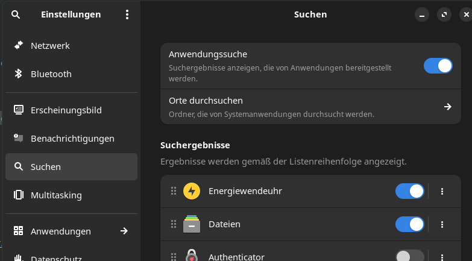

# gnome-energiewende-search-provider
Mit diesem Search Provider kann man den Status der Energiewendeuhr direkt in der GNOME-Shell-Suche anzeigen!
Ideal, um ganz schnell den erneuerbaren Anteil im Netz nachzuschauen, ohne die Webseite öffnen zu müssen.


Modifiziert von [cnjhb's gnome-command-search-provider](https://github.com/cnjhb/gnome-command-search-provider)

Sobald "ew" im Suchfeld erkannt wird, wird der Status der Energiewendeuhr von wieland.srvx.de geladen und angezeigt.
Wenn man auf die Zeile klickt, öffnet sich zusätzlich die Energiewendeuhr-Seite im Browser.

getestet unter Manjaro, sollte aber mit jedem Linux-System mit GNOME-Desktop funktionieren.

## Installation
``` bash
git clone https://github.com/s12wu/energiewendeuhr
cd energiewendeuhr/goodies/gnome-energiewende-search-provider
sudo ./install.sh
```
und ab- und wieder anmelden. Dann in den Einstellungen > Suche den Search provider aktivieren:


Entfernen:
``` bash
sudo ./uninstall.sh
```

